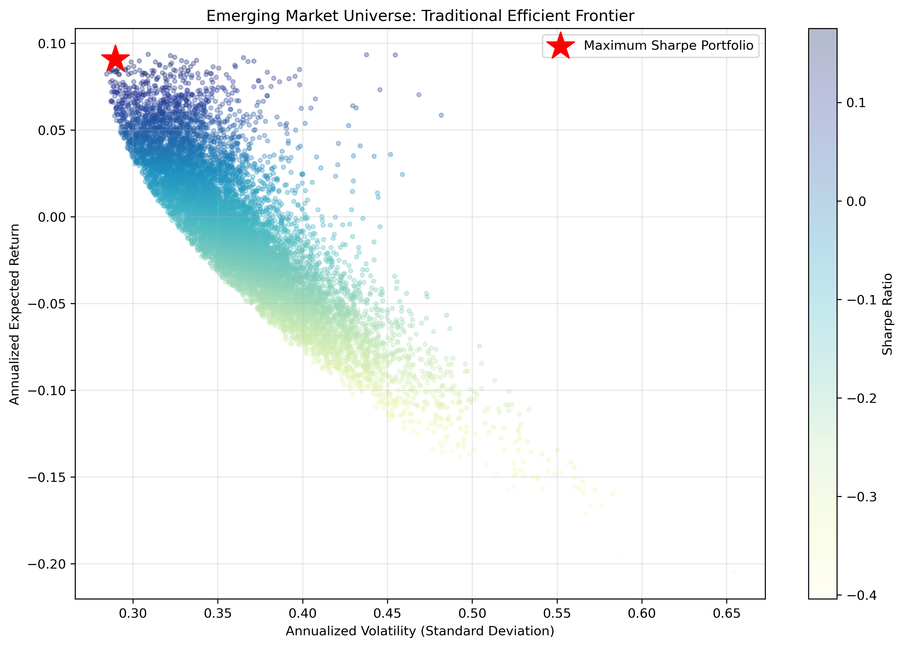
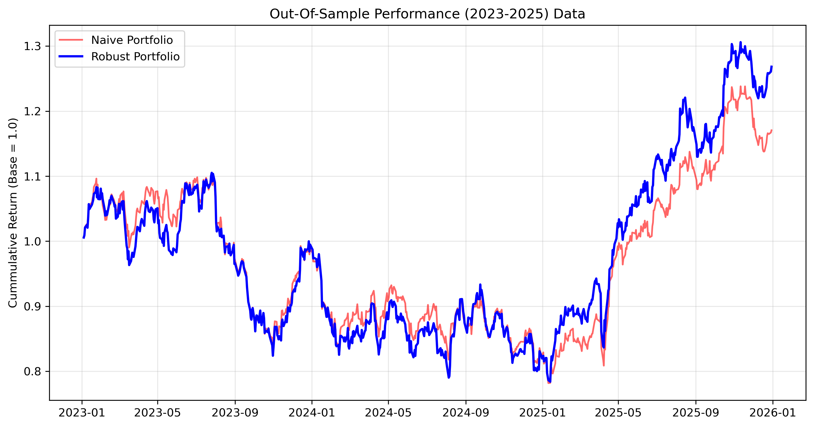

# Robust Portfolio Optimization in Emerging Markets

## Objective
Classical Mean-Variance Optimization (MVO) is highly sensitive to estimation error. Small changes in historical returns or covariances can lead to dramatically different allocations, often resulting in concentrated portfolios that perform poorly in unseen market conditions.

This project empirically investigates this fragility. It compares a traditional Markowitz optimizer against a robust model combining **Ledoit-Wolf covariance shrinkage** and **SLSQP weight constraints**, using a strict out-of-sample backtest to measure true risk-adjusted survival.

## Asset Universe
The portfolio consists of five high-growth emerging-market equities. These assets were selected because emerging markets exhibit high volatility, fat-tailed distributions, and noisy covariance estimates, providing a rigorous stress-test environment for optimization models:
* `ITUB` — Brazilian Banking
* `STNE` — Latin American FinTech
* `HDB`  — Indian Banking
* `AMX`  — Latin American Telecommunications
* `MTNOY`— African Telecommunications

## 1. Classical Mean-Variance Optimization (The Baseline)
Daily log returns (2018–2022) were used to estimate expected annual returns and the historical covariance matrix. A Monte Carlo simulation of 10,000 portfolios approximated the efficient frontier to find the maximum Sharpe Ratio allocation.

*`*

**Observation:** The unconstrained Markowitz optimizer acted as an "error maximizer." It concentrated heavily on past winners, which appears optimal in-sample but leaves the portfolio highly vulnerable to estimation error and geographic concentration risk.

## 2. Robust Portfolio Construction
To mitigate the impact of noisy covariance estimates and enforce structural diversification, two adjustments were made:
1. **Ledoit-Wolf Shrinkage:** The sample covariance matrix was replaced with a shrinkage estimator, pulling extreme, spurious historical correlations toward the center.
2. **SLSQP Constraints:** The optimization was solved deterministically using `scipy.optimize`, enforcing a strict boundary constraint where no individual asset could exceed 30% of total capital.

### Portfolio Weight Comparison (Trained on 2018-2022)
| Asset | Naive Portfolio (Unconstrained) | Robust Portfolio (Constrained) |
| :--- | :--- | :--- |
| **ITUB** |  47.64% | 30.00% |
| **STNE** | 35.44% | 30.00% |
| **HDB** |  1.22% | 15.47% |
| **AMX** | 15.25% | 24.53% |
| **MTNOY**| 0.45% | 0.00% |

## 3. Out-of-Sample Backtest (2023–2025)
A quantitative model is only as good as its performance on unseen data. To evaluate whether the allocations generalized beyond the training sample, the weights were frozen and applied to completely unseen market data from 2023 to 2025.

**

### Out-of-Sample Performance
| Metric | Naive Portfolio | Robust Portfolio |
| :--- | :--- | :--- |
| **Return** | 16.75% | 26.83% |
| **Volatility** | 19.30% | 19.52% |
| **Sharpe Ratio** | 0.87 | 1.37 |
| **Maximum Drawdown** | -28.14% | -29.06% |

## Key Findings & Conclusion
* **Estimation Sensitivity:** Standard portfolio optimization is highly sensitive to historical noise; concentrated portfolios may appear optimal in-sample while failing to generalize to new macro regimes.
* **Shrinkage Efficacy:** Ledoit-Wolf shrinkage successfully reduced the influence of extreme covariance estimates, producing more stable forward-looking risk estimates.
* **Out-of-Sample Survival:** By combining covariance shrinkage with allocation constraints, the Robust portfolio successfully avoided the overfitting trap, yielding a **57% increase in the out-of-sample Sharpe Ratio** while maintaining structural stability through violent emerging market drawdowns.
